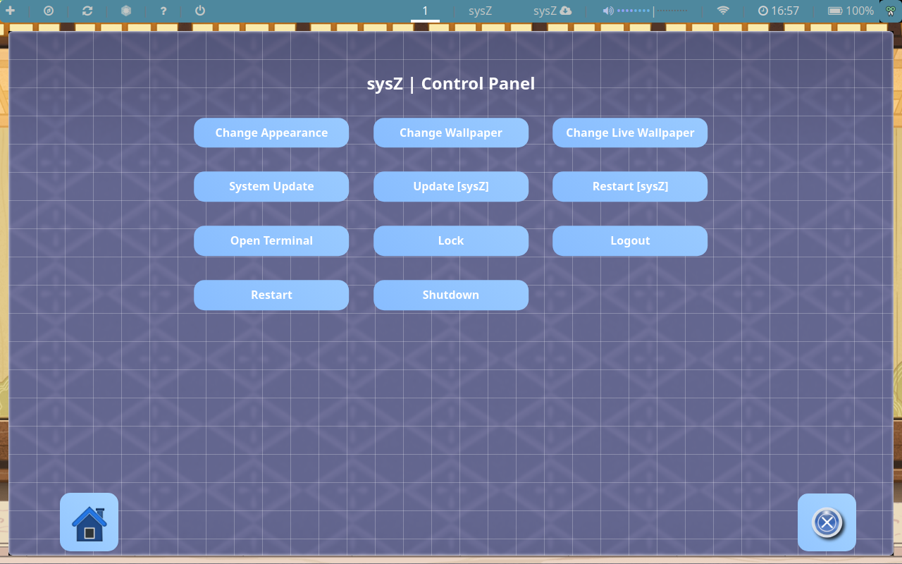
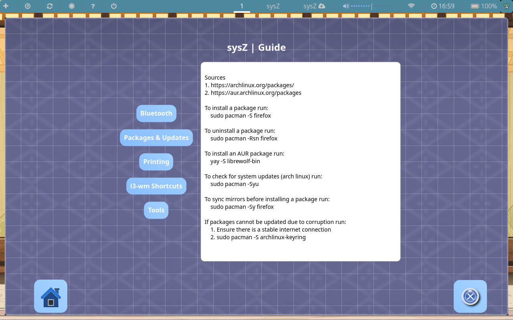
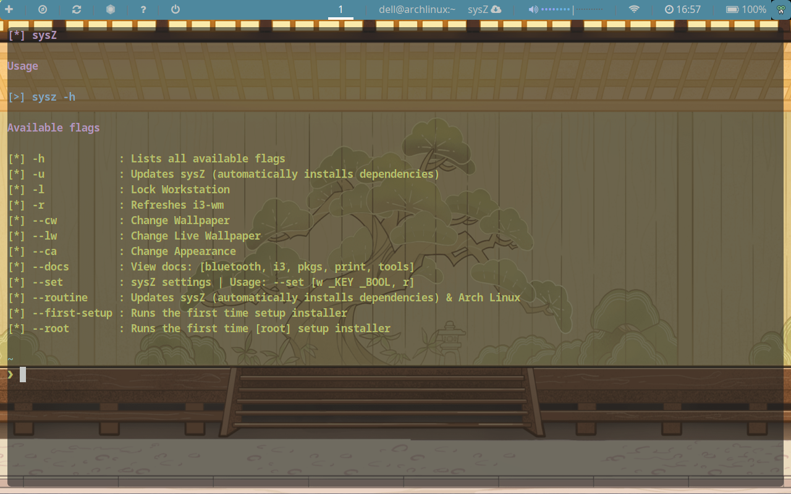

# sysZ

# What is sysZ?
* A preconfigured customization of the  [i3 Window Manager](https://github.com/Airblader/i3)
* The repository is synchronised across three of my computers for one click updating
* The idle ram usage used by default should be around 650MiB. sysZ should work on any intel based processor laptop. However, the architecture must be x86_64 and RAM should be greater than 2GB.

# Features within sysZ's customization:
* Wallpaper selection
* Live Wallpaper selection with automatic pausing
* Screensaver
* Bluetooth configuration
* Autostart file

# How to use
Open the control panel by pressing SUPER + i. There will be 4 categories: Change Log, Guides, Control Panel and Settings.

# Recommended way to install
WARNING! ~ This tool will override many of your configuration files! If you already have `i3-wm` setup it is highly recommended that you back up your existing `.config` folder. 
1. Download the latest [Arch Linux ISO](https://archlinux.org/download/)
2. Flash your [Arch Linux ISO](https://archlinux.org/download/) to a bootable USB flash drive. If you are on windows, you can use this [tool](https://rufus.ie/en/)
3. Boot into the live installation media and when Arch Linux boots up, synchronise mirrors (sudo pacman -Sy) then run [archinstall](https://github.com/archlinux/archinstall)
4. While using the [archinstall](https://github.com/archlinux/archinstall) script, select the `i3 window manager` in the `Profile(desktop` section.
5. Once Arch Linux has been setup, login to a user account and open a terminal ($mod+enter). In the terminal, run `sudo pacman -S git` and from the home directory, run `git clone https://github.com/AnAncientForce/sysZ.git`
6. Once cloned, `cd` into the `~/sysZ/shell` folder
7. Run `sh pull.sh --auto`
8. Proceed with any additional prompts

# Dependencies
- [i3-gaps](https://github.com/Airblader/i3)
- [betterlockscreen](https://github.com/betterlockscreen/betterlockscreen)
- [polybar](https://github.com/jaagr/polybar)
- [FontAwesome](https://github.com/FortAwesome/Font-Awesome)
- [You can see the full list here](https://github.com/AnAncientForce/sysZ/blob/main/shell/pull.sh)
